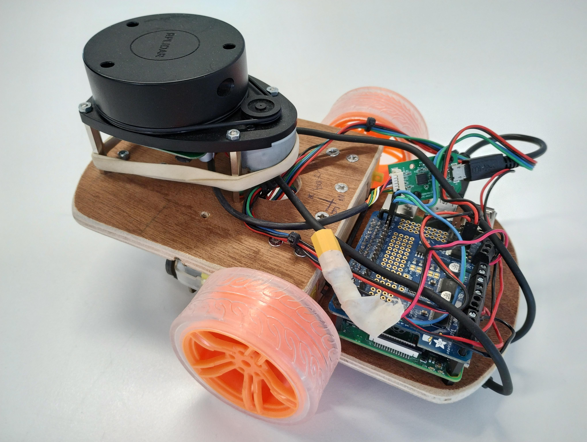
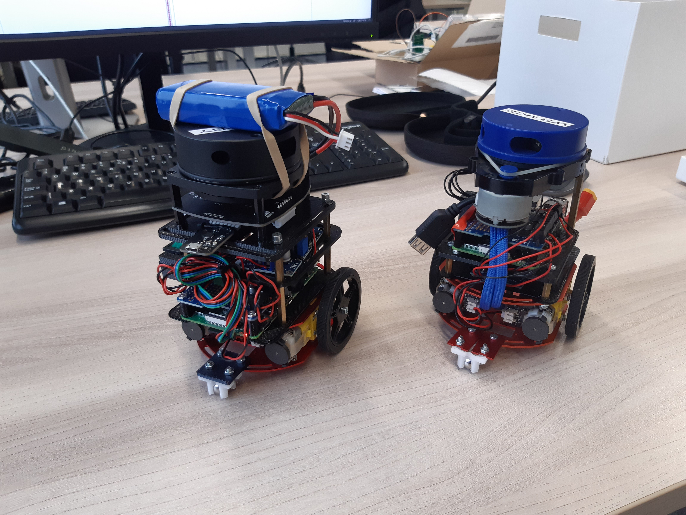

# Foresee the Unseen on a real robot

The main goal is to transfer the algorithm from the paper *Foresee The Unseen: Sequential Reasoning about
Hidden Obstacles for Safe Driving* ([IEEE](https://ieeexplore.ieee.org/document/9827171) / [open access link](https://www.diva-portal.org/smash/get/diva2:1635726/FULLTEXT01.pdf)) to a real robot and to verify its performance in the real world. The goal of this algorithm, which is further referred to as **Foresee the Unseen** is to safely, but not overconservatively deal with occlusions encountered by autonomous vehicles. The algorith is implemented in ROS and this repository also contains all the code to get control the robot. The picture below shows the robots on which the software is usable.

The 'autonomous vehicle'             |  The obstacle cars
:-------------------------:|:-------------------------:
  |  

The video below shows a preliminairy result of the implemented algorithm.

## Description of the packages
A short description of all the packages in this repo is given below. The code was written as part of my graduation internship at ALTEN and most of the code used to control the robot was written by Catuja Smit.

### `foresee_the_unseen`

This code package implements the Foresee the Unseen algorithm and is still under development. Moreover, it contains the launch files to run the robot, which use the following ROS packages for localization. I wrote a tutorial on how to use these packages for a course in the Master Robotics at the Technical University of Delft, which can be found [here](https://github.com/christiaantheunisse/localization-with-ROS):

- `slam_toolbox`: Lidar-based SLAM is used for the localization of the robot. However, the SLAM node has to be run on a laptop since the Raspberry Pi 4 cannot handle the computational load.
- `robot_localization`: An EKF is implemented which relies on the Lidar-based SLAM, the odometry and an IMU and is able to provide a stable position and velocity output.

### `racing_bot_controller`

This package has two nodes. One node to convert ROS Twist messages (linear and angular velocity) to motor pwm values for a differential drive robot (DDR) which are published as an array of integers. I added an simple node to send these messages based on keyboard inputs.

### `racing_bot_encoder`

This package contains one node that reads the values from the encoders and publishes these on a topic. I changed the published message type to a custom message described in `racing_bot_interfaces`, namely `EncoderValues.msg`. This message contains both encoder readings and a timestamp to improve the velocity calculation in the odometry node.

### `racing_bot_hat`

This package contains one node that controls the motors through the Adafruit motor driver hat that sits on top of the Raspberry Pi. I have not made any significant changes to this node.

Install the required `pigpiod` library on the Raspberry Pi ([installation instructions](https://abyz.me.uk/rpi/pigpio/download.html)).

### `racing_bot_imu`

This packages contains one node that reads the values from an IMU and publishes them. The MadgwickAHRS algorithm is used to calculate the orientation. I added some missing dependencies files for the algorithm that were missing in the version I got and changes to frames to make them work with the IMU I got (my IMU, like a lot of IMUs outputs the readings in a lefthanded coordinate frame.)

### `racing_bot_interfaces`

Contains the custom message types.

### `racing_bot_odometry`

The single node in this package calculates the position and velocity based on the encoder readings. The position calculations take a more geometrical approach now and are independant of the velocity. The velocity calculations are now based on multiple past measurement to reduce the noise and take the measurement time into account.

### `racing_bot_trajectory_follower`

I wrote this package from scratch and it contains a single node which enables the robot to follow a trajectory. The node uses Stanley steering to control the steering angle and a P-controller for the velocity. The idea and initial implementation were taken from [PythonRobotics](https://github.com/AtsushiSakai/PythonRobotics?tab=readme-ov-file#stanley-control), although a lot of changes were made to make it applicable to differential drive robots and make it track a list of stamped states. 

The input message type is defined in `racing_bot_interfaces` in `Trajectory.msg`, which contains a list of states. Every state consists of a position, velocity, acceleration and time stamp. However, the time stamp and acceleration are optional. The time stamp is necessary when the goal states of the robot are time dependant and the accelerations can be provide as an initial guess for the necessary change in the PWM signal. However, the mode that uses the accelerations makes the robot velocity unstable and wiggly!

